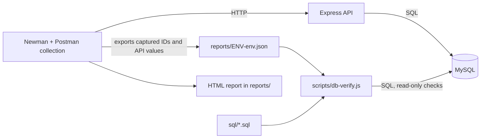
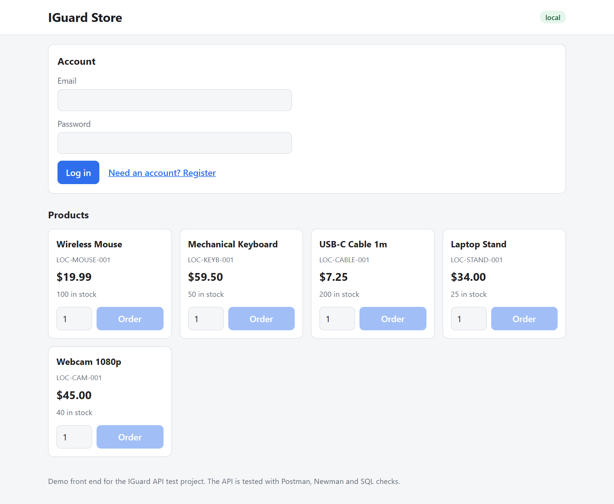
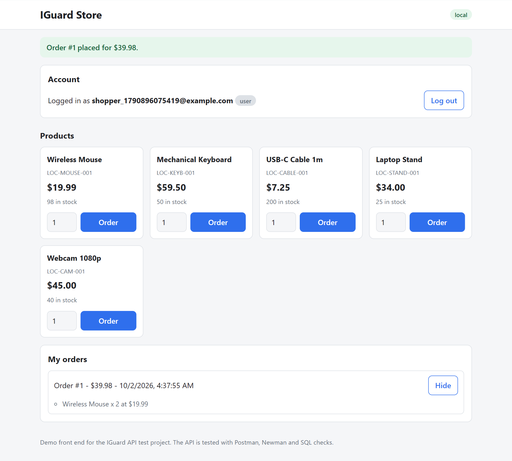
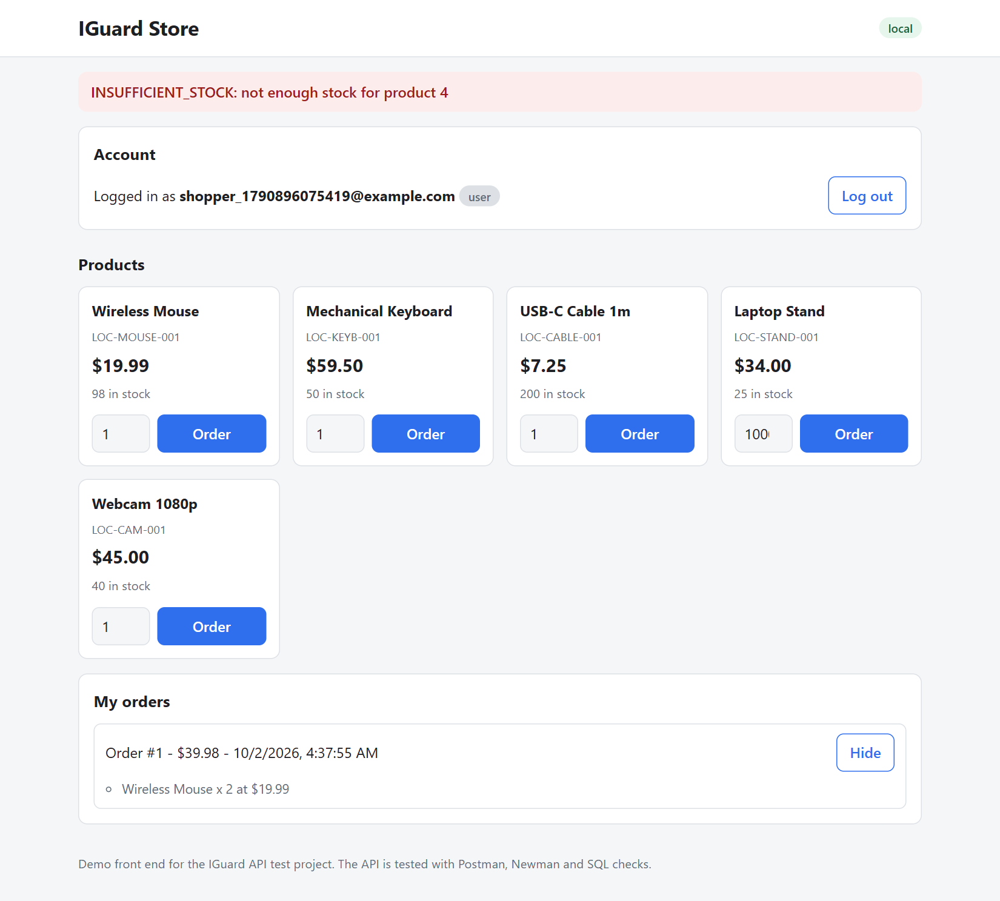
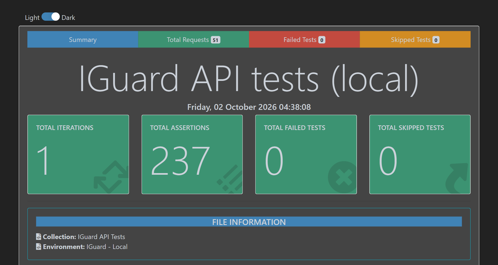
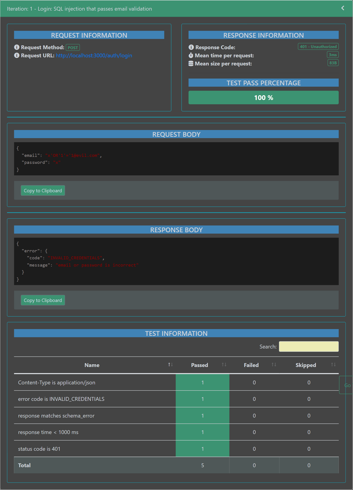

# IGuard - API & Data Validation Suite

A QA automation project that tests a REST API **and proves the API's answers match what is
actually stored in MySQL**.

- **Postman collection** with local and staging environments, chained requests, CRUD,
  authentication and 31 negative scenarios.
- **Assertions** on every request: status code, response time, headers and JSON schema.
- **13 SQL queries** that verify API-created, updated and deleted data against the database.
- **Newman automation** with HTML reports, a data-driven run, and a GitHub Actions workflow.

**Tech stack:** Postman, Newman (+ newman-reporter-htmlextra), REST, SQL, MySQL 8, Node.js,
Docker Compose, GitHub Actions.

## Overview
The system under test is a deliberately small Express + MySQL store API (users, products,
orders). It exists so the tests have something real to test, and so "API vs database"
verification is genuine: the database is ours, so a created, updated or deleted record can be
checked with plain SQL. Testing is the focus, not the backend. Requirements are in
[`docs/prd.md`](docs/prd.md) and the design decisions (with reasons) in
[`docs/design.md`](docs/design.md).

## Architecture

Docker Compose runs one MySQL server holding two databases and two API containers:

| Environment | API | Database |
|---|---|---|
| local | `localhost:3000` | `iguard_local` (5 seeded products) |
| staging | `localhost:3001` | `iguard_staging` (7 seeded products, different JWT secret) |

MySQL is published on host port **3307** (so it never clashes with a MySQL you already have).

**API surface:** `POST /auth/register`, `POST /auth/login`; `GET/POST/PUT/DELETE /products`
(reads are public, writes need an admin token); `POST/GET /orders` (own orders only; the API
computes the total and reduces stock inside one transaction).

## Prerequisites
Docker Desktop and Node.js 20 or newer.

## Setup
```bash
cp .env.example .env          # dev-only placeholders; edit the secrets if you like
npm install                   # Newman, htmlextra reporter, mysql2
npm run db:up                 # MySQL + local API (:3000) + staging API (:3001)
curl localhost:3000/health    # {"status":"ok","env":"local"}
curl localhost:3001/health    # {"status":"ok","env":"staging"}
```
Seeded test accounts (dev only) are listed in `.env.example`. No real secret is committed:
the JWT secrets live in `.env` (git-ignored) and in CI secrets.

## Demo storefront
The API also serves a small storefront (plain HTML, CSS and JavaScript in `app/public/`).
Open **http://localhost:3000** (local) or **http://localhost:3001** (staging); the badge in the
header shows which environment the page is talking to. You can browse products, register and
log in, place an order, and see your orders. API errors are shown as the API sent them.
It is a demo front end for the API, not part of the test suite's target. Seeded accounts are
in `.env.example`.

Logged out: products are visible, ordering is disabled.



Logged in, after placing an order (stock dropped from 100 to 98, order details expanded):



Ordering more than the stock shows the API's real error:



All API data is inserted into the page with `textContent` (never `innerHTML`), because
product names are user input.

## How to run
```bash
npm run test:local          # Newman against local, HTML report, then SQL checks
npm run test:staging        # same against staging
npm run test:all            # local, then staging
npm run test:data           # data-driven: one iteration per row of postman/data/products.csv
npm run db:verify           # re-run only the SQL checks against the last local run
npm run db:reset            # wipe both databases back to seed data
```
Each `test:*` command reads the JWT secret from `.env`, runs the collection, writes the
report, and exits non-zero if any assertion or SQL check fails (so CI goes red). The tests
use unique generated data, so you can run them repeatedly without resetting.

`test:data` runs only the Auth and Products CRUD folders (the CSV drives product name, price
and stock) and skips the SQL step, because the SQL checks need IDs from a full run.

**Using Postman instead:** import `postman/iguard.collection.json` and one file from
`postman/environments/`, then run the collection. `jwtSecret` is a placeholder
(`SET_ME_LOCALLY`) in git; set the real value from `.env` for the expired-token test.

## Reports
HTML reports (newman-reporter-htmlextra) are written to `reports/<env>-<timestamp>.html`.
Open one in a browser. In CI they are uploaded as the `newman-reports` artifact of each run.
`reports/<env>-env.json` holds the variables Newman captured and feeds the SQL checks.
Both are git-ignored.

**Report summary** (local run: 237 assertions, 0 failed):



**One negative scenario in the report**: a SQL-injection login that passes email validation and
reaches the query. The API answers 401 `INVALID_CREDENTIALS`, and all five assertions pass
(status, error code, error schema, response time, `Content-Type`):



## Test case summary
Each full run executes **47 requests and 237 assertions** per environment. (The Newman report
shows 51 "requests": it also counts the 4 helper calls that test scripts make with
`pm.sendRequest` to check side effects.)

| Folder | Requests | What it covers |
|---|---|---|
| `00 Health` | 1 | API reachable; the API's reported environment matches the selected Postman environment |
| `01 Auth` | 3 | Register (unique generated email), login as the new user and as admin; tokens captured into variables |
| `02 Products CRUD` | 7 | Create (generated data), read one, list, update, then create-and-delete a temporary product and confirm 404 |
| `03 Orders` | 4 | Create an order with the captured product ID, read it, list own orders, confirm stock decreased |
| `04 Negative` | 31 | See the table below |
| `99 Final Snapshot` | 1 | Saves the final product count for the SQL checks |

Every request also gets a status assertion, a response-time assertion (< 1000 ms), a
`Content-Type` assertion and a JSON schema check (`additionalProperties: false`, so a leaked
field fails).

**Negative scenarios** (each asserts the exact status, the exact error `code` and the error schema):

| Scenario | Requests | Expected |
|---|---|---|
| Missing, garbage and expired token | 3 | 401 `TOKEN_MISSING` / `TOKEN_INVALID` / `TOKEN_EXPIRED` |
| Wrong password, unknown email, missing password | 3 | 401 `INVALID_CREDENTIALS` (x2), 400 `VALIDATION_ERROR` |
| Malformed JSON body | 1 | 400 `INVALID_JSON` |
| Register with missing email, duplicate email | 2 | 400 `VALIDATION_ERROR`, 409 `EMAIL_EXISTS` |
| Product with missing name, negative price, string stock | 3 | 400 `VALIDATION_ERROR` |
| Duplicate SKU | 1 | 409 `SKU_EXISTS` |
| Non-admin create/delete, delete with no token | 3 | 403 `FORBIDDEN` (x2), 401 `TOKEN_MISSING` |
| Nonexistent product ID | 1 | 404 `NOT_FOUND` |
| SQL-injection-style input (ID, two logins, a name) | 4 | 404, 400, 401, and 201 stored safely with the users table intact |
| Wrong HTTP methods (`PATCH` product, `DELETE` login) | 2 | 405 `METHOD_NOT_ALLOWED` |
| Order with empty items, qty 0, negative qty | 3 | 400 `VALIDATION_ERROR` |
| Order for a nonexistent product | 1 | 404 `PRODUCT_NOT_FOUND` |
| Order over stock, same product twice over stock | 2 | 409 `INSUFFICIENT_STOCK` (and stock unchanged after the rollback) |
| Reading another user's order | 1 | 404 `NOT_FOUND` |
| Deleting a product that is in an order | 1 | 409 `PRODUCT_IN_USE` |

**SQL validation** (`sql/`, run by `scripts/db-verify.js`; see [`sql/README.md`](sql/README.md)
for what each query proves): 13 checks covering row exists, field values match, deleted rows
are gone, no duplicates, no orphan rows, counts match, order total equals the sum of its items,
and stock decreased by the ordered quantity.

**Proof the tests can fail:** a wrong JWT secret fails the expired-token test; changing a row
in MySQL by hand fails the matching SQL check; `--env-var maxResponseMs=1` fails every
response-time assertion.

## Continuous integration
`.github/workflows/newman.yml` runs on every push and pull request: it builds and starts the
stack with Docker Compose, waits for both APIs, runs `npm run test:all` (Newman + SQL checks
for local and staging), and uploads the HTML reports. Optionally add repository secrets
`JWT_SECRET_LOCAL` and `JWT_SECRET_STAGING`; otherwise CI uses dev-only defaults.

## Project structure
```
docs/        PRD, design document, implementation plan, resume evidence, interview prep
app/         the system under test (Express API, Dockerfile) and its demo storefront (app/public)
db/          schema and seed data for both environments (loaded by Docker on first start)
postman/     collection, local/staging environments, CSV data file
sql/         13 verification queries + README explaining each
scripts/     run-newman.js (Newman runner), db-verify.js (SQL checks), load-env.js
reports/     generated HTML reports and Newman exports (git-ignored)
.github/     GitHub Actions workflow
```
